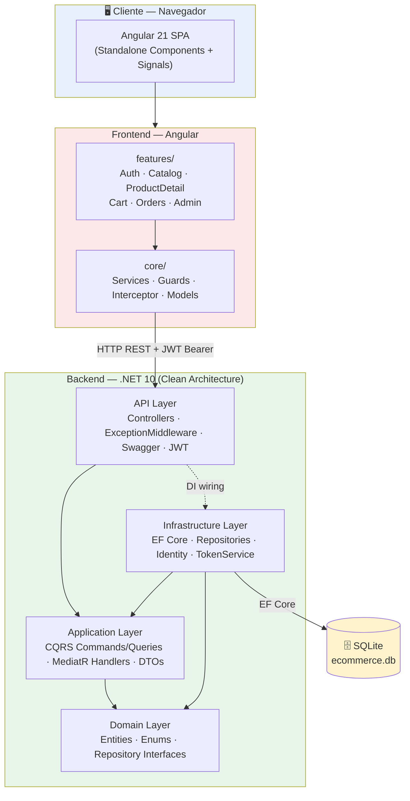
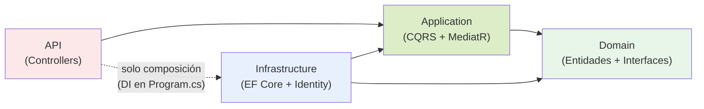
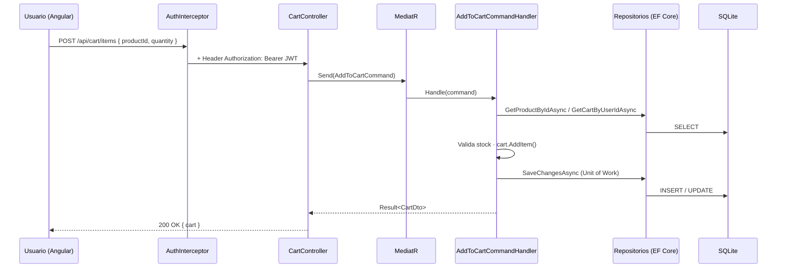

# Diagrama de Arquitectura General

Sistema E-Commerce MVP — Universidad EAFIT.

> Los diagramas usan sintaxis **Mermaid**, que GitHub renderiza nativamente. Para la sustentación se pueden exportar como imagen desde [mermaid.live](https://mermaid.live).

## 1. Arquitectura del Sistema (vista general)

## 2. Clean Architecture — Regla de Dependencias

Las dependencias apuntan **siempre hacia el centro**. El `Domain` no conoce a nadie; las capas externas dependen de las internas.

**Por qué importa:** el `Domain` y la lógica de negocio (`Application`) no dependen de Entity Framework, ASP.NET ni de ningún framework. Esto los hace testeables de forma aislada (ver `ECommerce.Tests`) y permite cambiar la base de datos o el proveedor de autenticación sin reescribir reglas de negocio.

## 3. Flujo de una Petición (ejemplo: agregar al carrito)

## 4. Componentes por Capa

| Capa | Proyecto / Carpeta | Responsabilidad |
|------|--------------------|-----------------|
| Presentación | `frontend/ecommerce-app` | SPA Angular: UI, estado reactivo, rutas, guards |
| API | `ECommerce.API` | Endpoints REST, autenticación JWT, Swagger, manejo global de errores |
| Application | `ECommerce.Application` | Casos de uso (CQRS), validación, orquestación, DTOs |
| Domain | `ECommerce.Domain` | Entidades, reglas de negocio, contratos (interfaces) |
| Infrastructure | `ECommerce.Infrastructure` | Persistencia (EF Core), Identity, generación de JWT |
| Datos | SQLite (`ecommerce.db`) | Almacenamiento relacional |
| Tests | `ECommerce.Tests` | Pruebas unitarias de Domain y Application |
