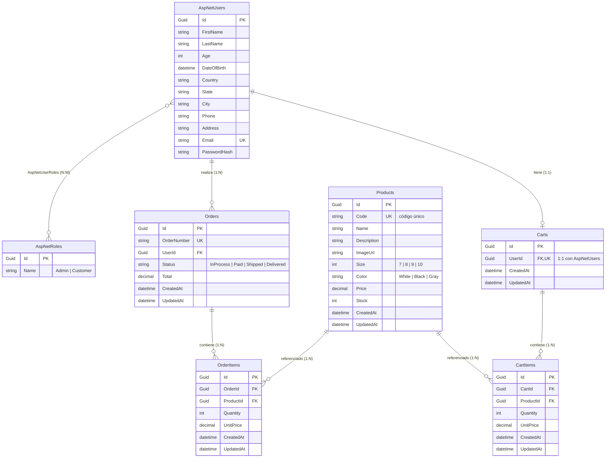

# Modelo Entidad-Relación

Sistema E-Commerce MVP — Base de datos relacional SQLite, gestionada con Entity Framework Core 10.

> Diagrama en sintaxis **Mermaid** (renderizable en GitHub o en [mermaid.live](https://mermaid.live)).

## Diagrama ER

## Tablas y Claves

| Tabla | PK | FK | Índices únicos |
|-------|----|----|----------------|
| `AspNetUsers` | `Id` | — | `Email` |
| `AspNetRoles` | `Id` | — | `Name` |
| `AspNetUserRoles` | `(UserId, RoleId)` | `UserId → AspNetUsers`, `RoleId → AspNetRoles` | — |
| `Products` | `Id` | — | `Code` |
| `Carts` | `Id` | `UserId → AspNetUsers` | `UserId` (relación 1:1) |
| `CartItems` | `Id` | `CartId → Carts`, `ProductId → Products` | — |
| `Orders` | `Id` | `UserId → AspNetUsers` | `OrderNumber` |
| `OrderItems` | `Id` | `OrderId → Orders`, `ProductId → Products` | — |

## Comportamiento de Borrado (Delete Behavior)

| Relación | Regla | Justificación |
|----------|-------|---------------|
| `AspNetUsers → Carts` | **Cascade** | El carrito no tiene sentido sin su usuario |
| `Carts → CartItems` | **Cascade** | Los ítems pertenecen al carrito |
| `Orders → OrderItems` | **Cascade** | Los ítems pertenecen a la orden |
| `AspNetUsers → Orders` | **Restrict** | Una orden es un registro histórico/contable; no se borra al borrar el usuario |
| `Products → CartItems` | **Restrict** | Evita borrar un producto que está en carritos activos |
| `Products → OrderItems` | **Restrict** | Preserva la integridad histórica de las órdenes |

## Decisiones de Modelado

- **`UnitPrice` se copia en `CartItems` y `OrderItems`:** se guarda el precio al momento de agregar el producto. Si el precio del producto cambia después, la orden conserva el precio histórico real (snapshot). Esto es estándar en e-commerce.
- **`Total` se persiste en `Orders`:** se calcula en el checkout y se almacena, evitando recálculos y garantizando consistencia con los `UnitPrice` históricos.
- **`Status` y `Color` se almacenan como `string`:** mejor legibilidad al inspeccionar la BD directamente; `Size` se guarda como `int` porque su valor numérico (7-10) es semánticamente significativo.
- **Tablas `AspNet*`:** generadas por ASP.NET Core Identity. `AspNetUsers` está extendida con los campos del registro (nombres, edad, dirección, etc.). Se omiten del diagrama las tablas auxiliares `AspNetUserClaims`, `AspNetUserLogins`, `AspNetUserTokens` y `AspNetRoleClaims` por no ser relevantes al dominio.
- **Identificadores `Guid`:** evitan colisiones, no exponen conteos de negocio y facilitan generación distribuida.
